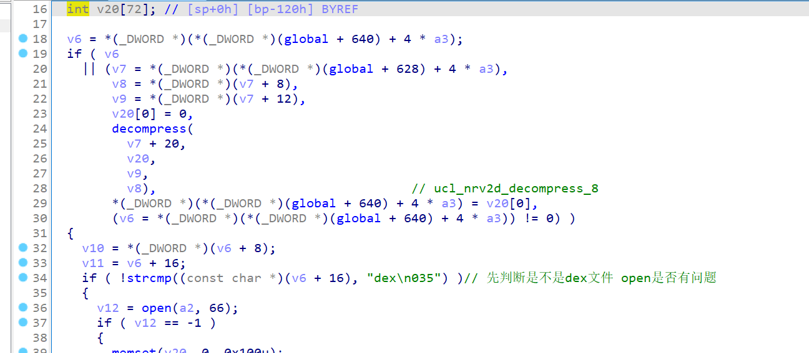

#  腾讯乐加固

先看看java层，乐加固对application的编写


attachbasecontext先运行，再看看initproxyApplcation


主要是System.loadlibrary,加载so libshell-super.2019.so

接着进入c层看看initarray,主要是设置环境变量，配置环境，接着看看jni_onload,主要是ollvm了，经过调试，发现几个函数是比较重要的

首先经过sub_dac4


将mpackageinfo,classloade一些信息放在global里面，用于之后之后替换classloader,applcationn


接着将一些文件打开，判断架构走不同的路线


接着走sub_d01c


将0OO00l111l1l打开，并映射到内存上面去 ，0OO00l111l1l是加密后的dex 里面就是脱壳的内容


接着 根据文本里面的内容，将一些到时候解密的关键信息放在global结构体里


接着回到jni_onload执行，执行到sub_7098 load dex 主要先进行文件夹的初始化操作，之后判断是android是不是10 ndk版本，是的话将global+696 赋值1，不是的话判断有没有xposed,走两个不同的方案，因为我手机是android 10,先说说我的这个方案


中间一些得到信息，设置一些环境就不分析了，主要跳到关键的流程 主要根据dex_num的数量，对每个dex开启一个线程执行sub_700c,接着进入700c看看干了什么


在700c中，首先是根据加密的内容，在create_dex中创造出dex文件，不过是没指令的 全是nop，接着在full_dex填充指令


接着进入create_dex看看，首先判断00O000ll111l_%d.dex存不存在，打开然后进入流程


接着查看sub_4e5c

根据global里面的信息，对加密的内容解密 ucl_nrv2d_decompress_8 判断是不是dex文件 open是否有问题



没问题，就将解密后的内容写入,当然是还没填充指令的dex


接着进入full_dex，先xxtea 再decrompress解压


之后在这里就产生分歧，走2个不同方案了,如果696是1就现在填充，不的话走另一个方案


而696为1，有两处地方,要么android 版本为10，要么有xposed


另一个方案就是如果没有xposed就重新注册defineclass_native ,这个函数是loaddex的底层函数，可以看我的android-pack


## 脱壳

如果你的系统不是android 10 frida hook

hook libc的strstr

```
int new_strstr(char *str1, char *str2) {
    if (strcmp("xposed", str2) == 0) {
        return 1;
    }
    return old_strstr(str1, str2);
}
```

然后再hook libart的DefineClassNative对dex进行整体dump.

 

这种情况，dump出的dex全部是完整的。

如果是10的话，就多一个hook strcmp 就行