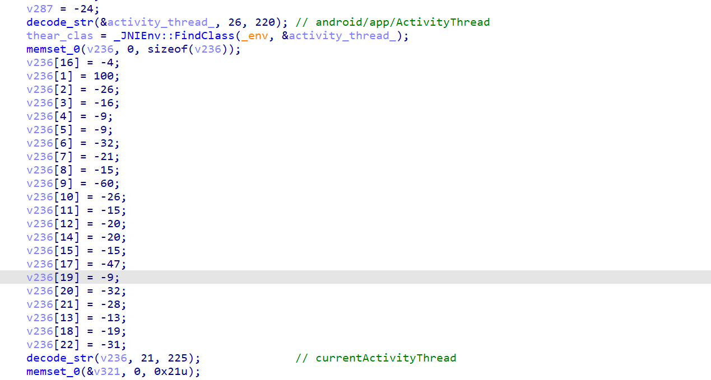
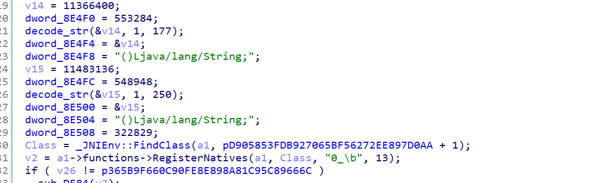
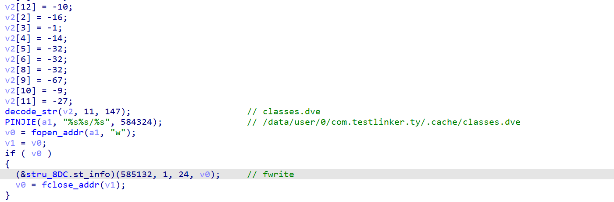
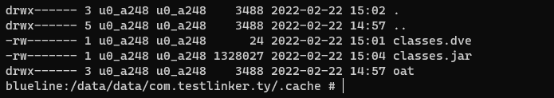
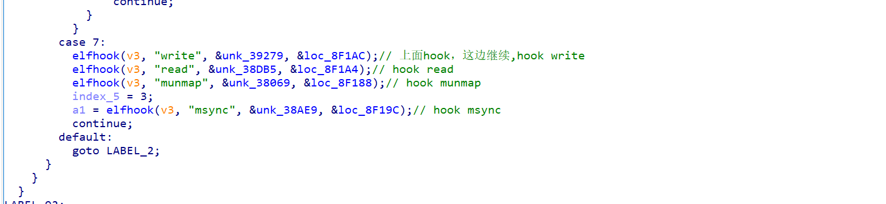
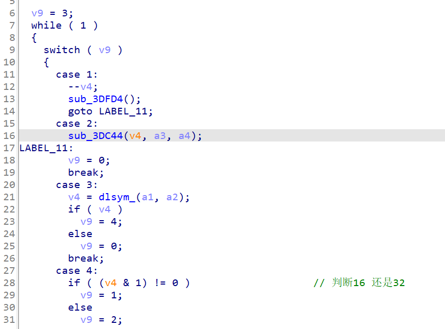

# 梆梆加固

首先看看java层



没什么特别的，接着进入c层看看secshell.so



发现smc了，不过没有关系 frida dump下来再看看，不过反正要调试的，dump下来也最多静态看看

```js
var exports = Module.enumerateExportsSync("libSecShell.so");
var libxx = Process.getModuleByName("libSecShell.so");
console.log("*****************************************************");
console.log("name: " +libxx.name);
console.log("base: " +libxx.base);
console.log("size: " +ptr(libxx.size));
 
var exports = Module.enumerateExportsSync("libSecShell-x86.so");
for(var i = 0; i < exports.length; i++) {
        console.log(exports[i].name + ": " + (exports[i].address - libxx.base));
}
// dump so
var file_path = "/data/local/tmp/" +  "dump.so";
var file_handle = new File(file_path, "wb");
if (file_handle && file_handle != null) {
    Memory.protect(ptr(libxx.base), libxx.size, 'rwx');
    var libso_buffer = ptr(libxx.base).readByteArray(libxx.size);
    file_handle.write(libso_buffer);
    file_handle.flush();
    file_handle.close();
    console.log("[dump]:", file_path);
}
```

之后动态调试 寻找jni_onload  init_array

init_array没啥事，就是设置一下环境，不放图了，主要是jni_onload

放置环境变量的部分，我跳过了，主要说一下主要的，这里将class0.jar放入内存zhon



之后应该是解密过了 放入class.jar



之后调用java函数 loadclass





脱壳：

第一代壳，所以直接dump就行 或者拿取class.jar