#  梆梆加固

首先看看java层

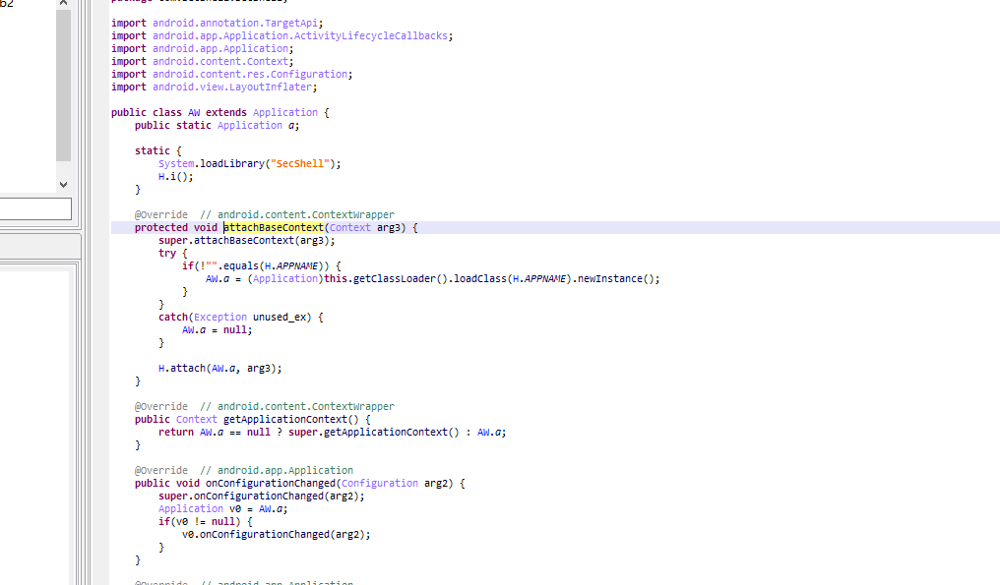

没什么特别的，接着进入c层看看secshell.so

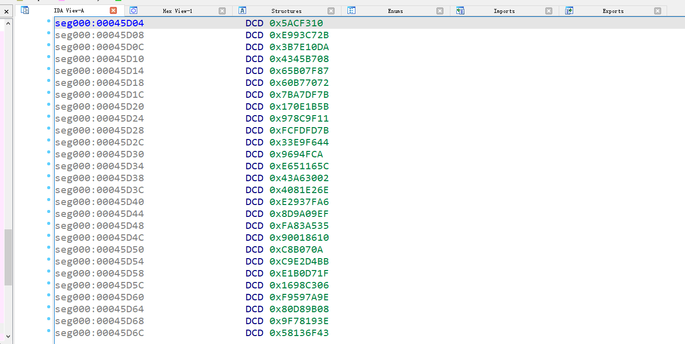

发现smc了，不过没有关系 frida dump下来再看看，不过反正要调试的，dump下来也最多静态看看

```js
var exports = Module.enumerateExportsSync("libSecShell.so");
var libxx = Process.getModuleByName("libSecShell.so");
console.log("*****************************************************");
console.log("name: " +libxx.name);
console.log("base: " +libxx.base);
console.log("size: " +ptr(libxx.size));
 
var exports = Module.enumerateExportsSync("libSecShell-x86.so");
for(var i = 0; i < exports.length; i++) {
        console.log(exports[i].name + ": " + (exports[i].address - libxx.base));
}
// dump so
var file_path = "/data/local/tmp/" +  "dump.so";
var file_handle = new File(file_path, "wb");
if (file_handle && file_handle != null) {
    Memory.protect(ptr(libxx.base), libxx.size, 'rwx');
    var libso_buffer = ptr(libxx.base).readByteArray(libxx.size);
    file_handle.write(libso_buffer);
    file_handle.flush();
    file_handle.close();
    console.log("[dump]:", file_path);
}
```

之后动态调试 寻找jni_onload  init_array

init_array smc解密，将jni_onload 这些函数解密，动态调试 执行好后 一切都恢复正常了，就直接来看jni_onload的执行过程，说实话，挺恶心的，全部字符串都用了混淆

先初始化，得到一些函数，初始化一些文件夹.cache ,再用jni得到一些壳所用到用到一些类 activitythread mpackageinfo 等等


之后动态注册了一坨函数 


之后 就实现文件落地了 ，原apk里是有个class0.jar 

先在.cache目录下 创造一个classes.dve fwrite写入 数据没仔细看是从哪里来的


之后，使用asset操作 打开原apk下的classes0.jar,getbuffer将它放入内存

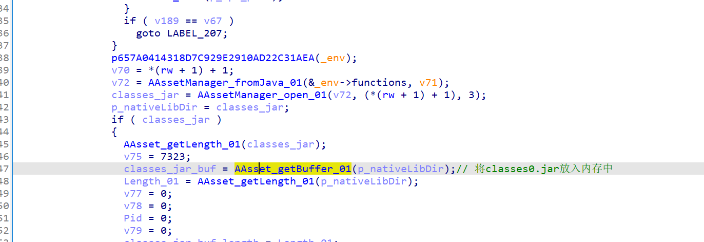

之后在.cache目录下open classes.jar 将classees0.jar的数据放入classes.jar 还是原始数据还没解密

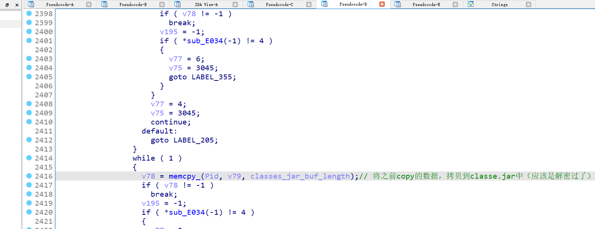

此时在.cache目录下有这两个文件


之后又hook了一堆函数 write read mummap,,openmemory,map 


这里的hook是inline hook 不得不说写的满nb的，来具体分析一下它的流程

函数主要是这样的


先走3 获得原本那个函数的地址，之后走4 获得thumb模式 还是arm-v7模式 arm进入2 thumb进入1

thumb没看，看看arm模式，经过调试，先mmap一段

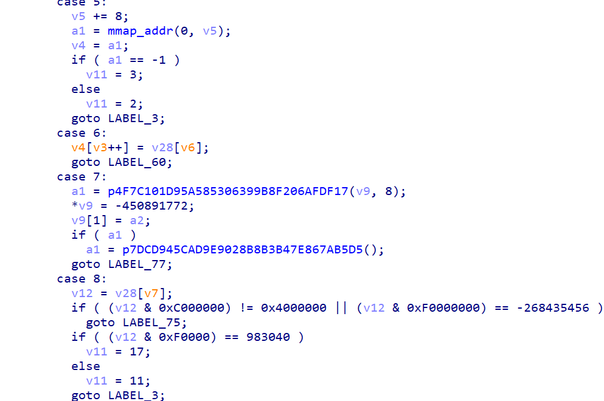


v4那里就是mmap的地址保存了一些数据（原函数的指令 地址） mprotect一下

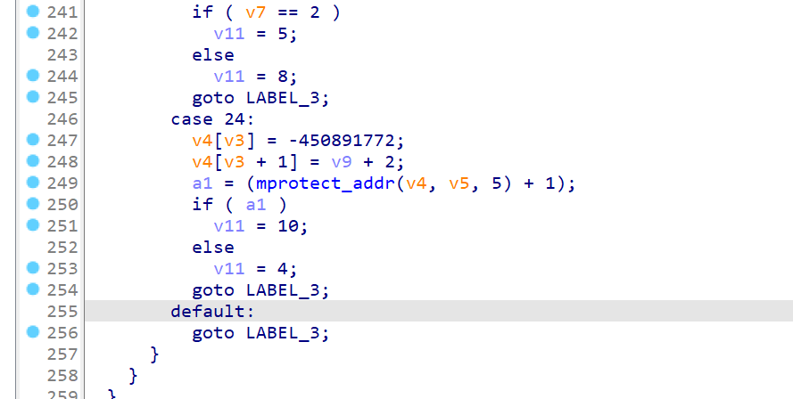

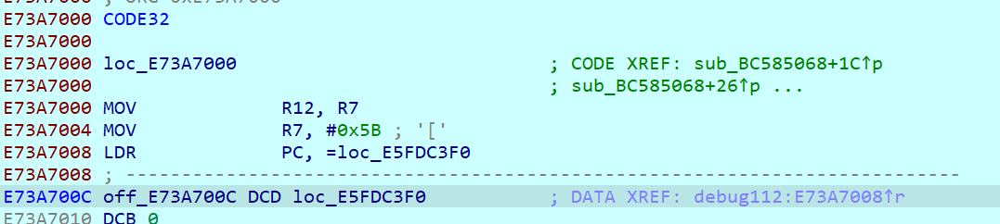

之后v9  在这里给原函数 inline hook ,将开头的两个指令 通过赋值改掉

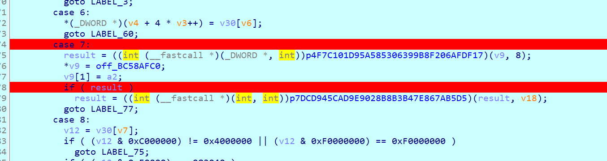

hook结束

之后解了密，密的过程没怎么看，然后load dex 加载dex文件

先构造路径

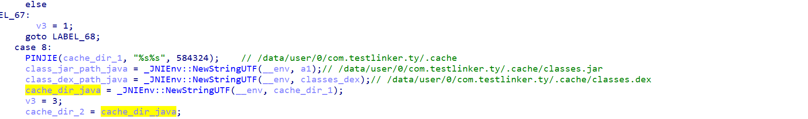

之后c层调用jni方法实现dex加载

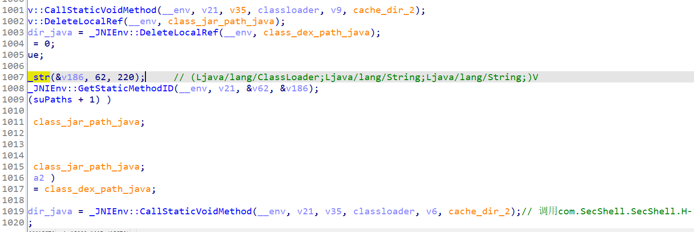


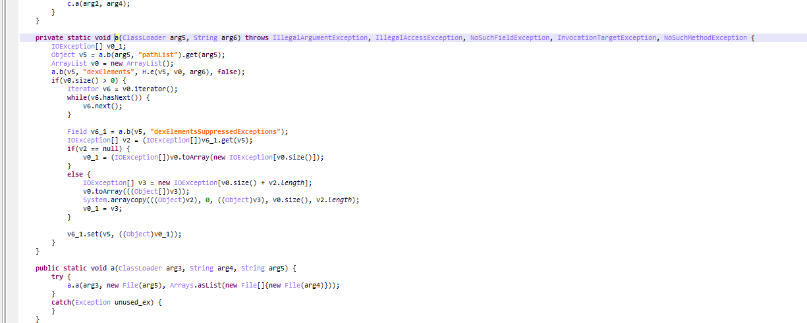

脱壳 在jni调用java方法 加载dex后 内存dump就行

